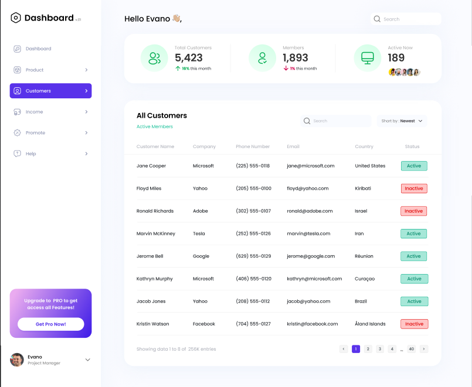
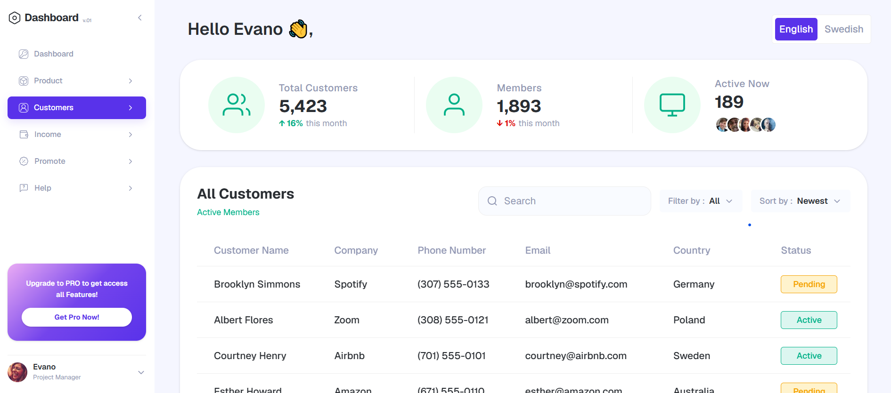
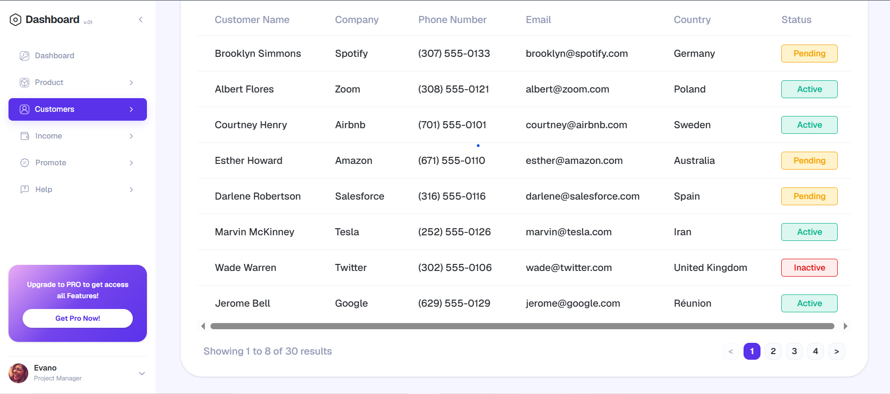
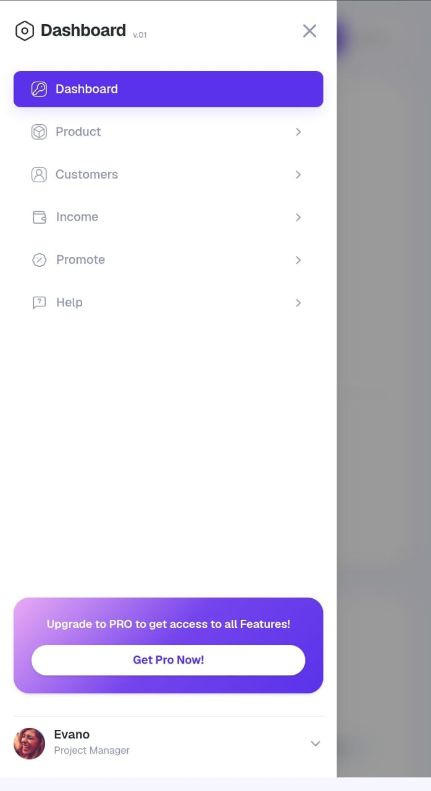
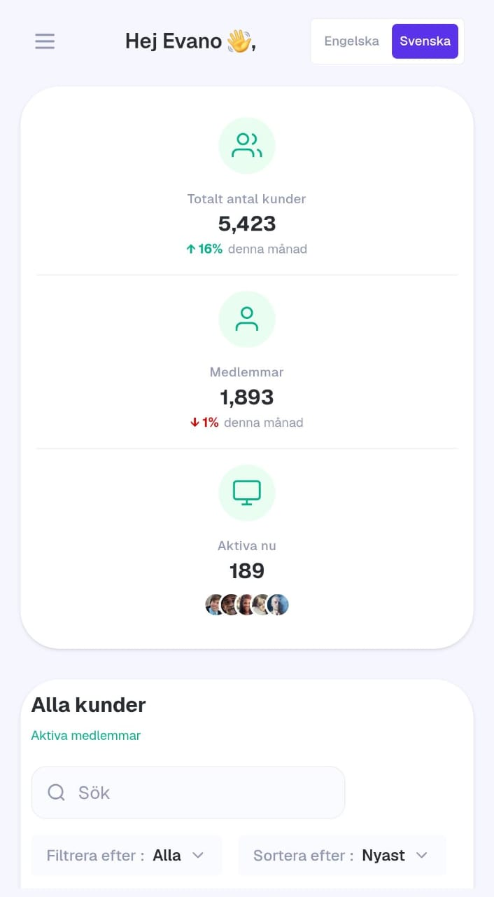
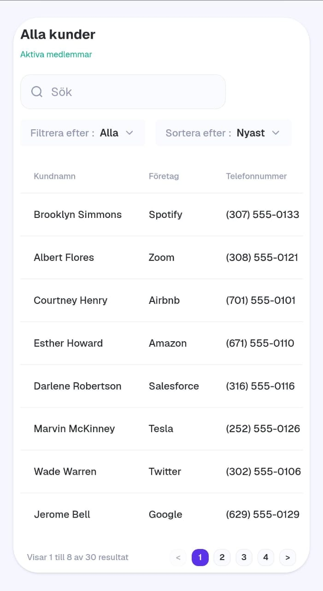

# CRM Customer Dashboard

A Next.js (App Router) implementation of a customer-management dashboard, converted from a Figma design. Built with TypeScript, Tailwind CSS, and `next-intl` for internationalisation (English / Swedish).

**Live demo:** (https://crm-dashboard-theta-silk.vercel.app)

**Repository:** (https://github.com/khadijafassih/crm-dashboard)

## Running locally

```bash
git clone <your-repo-url>
cd <your-repo-folder>
npm install
npm run dev
```

Open [http://localhost:3000](http://localhost:3000) — you'll be redirected to `/en` by default.

## Folder & component structure

```
app/
  [locale]/
    layout.tsx          # Locale-aware root layout, wraps app in NextIntlClientProvider
    page.tsx             # Dashboard page (composes layout + header + metrics + table)
  components/
    DashboardLayout.tsx   # Shell: sidebar + main content area
    Sidebar.tsx           # Desktop sidebar (collapsible, persisted via localStorage)
    Header.tsx            # Desktop/mobile header, greeting + language switcher
    MobileDrawer.tsx       # Slide-in nav for tablet/mobile (focus handling, Esc to close)
    MetricCardsRow.tsx / MetricCard.tsx   # Summary metric cards
    CustomerTable.tsx      # Table state: search, filter, sort, pagination
    CustomerTableRow.tsx    # Single row renderer
    StatusBadge.tsx         # Status pill (active/inactive/pending)
    SearchInput.tsx, Dropdown.tsx, Pagination.tsx, EmptyState.tsx
    LanguageSwitcher.tsx
    sidebar/              # Sidebar-only subcomponents (Logo, NavItems, ProCard, UserProfile, icons)
    icons/                 # Inline SVG icon components for metric cards
  hooks/
    useLockBodyScroll.ts, useMediaQuery.ts, useOnClickOutside.ts
data/
  customers.ts            # Local mock data (typed as Customer[])
types/
  index.ts                 # Customer & CustomerStatus types
i18n/
  routing.ts, request.ts    # next-intl routing + request config
messages/
  en.json, sv.json          # All UI copy, keyed by feature area
middleware.ts               # next-intl locale-detection middleware
```

Each visual section of the dashboard is its own component; 
`CustomerTable` is the only component holding non-trivial state (search/filter/sort/pagination), and it delegates rendering to smaller presentational components.

## Global theme

All design tokens (colors, radii, shadows) are defined once in `app/globals.css` using Tailwind v4's `@theme inline` block — e.g. `--color-primary`, `--color-surface`, `--color-border`, `--color-success`, `--radius-lg`. Components never hardcode hex values; they consume the tokens through Tailwind utility classes (`bg-surface`, `text-foreground`, `border-border`, `bg-primary`, etc.). Changing the palette or radii only requires editing the variables in one file.

## Internationalisation

- `next-intl` with the `[locale]` App Router segment; `middleware.ts` handles locale detection/redirects.
- All user-facing copy (nav labels, table headers, filters, pagination, empty states, etc.) lives in `messages/en.json` and `messages/sv.json` — nothing is hardcoded in components.
- `LanguageSwitcher` swaps the locale segment in the current path and uses `router.replace` inside a transition so the UI doesn't flash.
- Swedish strings are functional translations (not professionally localized) — their purpose is to demonstrate the i18n structure and confirm the layout holds up with longer text.

## Assumptions & design decisions

- **Sidebar: fixed, with a collapse toggle.** The Figma export is one large static frame that requires horizontal scrolling just to see the full dashboard — everything is scaled far bigger than a real product would ship. Rather than reproduce that, the sidebar here is fixed (always visible on desktop) and collapsible, and the page itself scrolls vertically while the customer table scrolls horizontally on narrower screens. On desktop, everything is visible without scrolling.
- **Nav items route locally but share content.** The Figma file only shows what the "Customers" nav state looks like — no other page states are designed. Each nav item links to a locale-aware route (`/en`, `/sv`), but since no other page content was specified, they all render the same dashboard rather than inventing pages that weren't part of the design.
- **Language switcher replaces the header search bar.** Figma's top-right header search box has no defined behavior and would duplicate the one functional search field the case explicitly asks for (the one beside the customer table, which matches Figma's second search box). The header slot was repurposed for the language switcher instead of shipping a second, non-functional search input.
- **Both Filter by and Sort by are present and functional.** Figma only shows a static "Sort by" control. Since the case requires a functional status filter, one was added alongside sort rather than replacing it — both are real, working dropdowns.
- **All responsive behavior, hover states, and dropdown interactions are original.** The Figma design doesn't specify any of these, so breakpoints, hover/focus styles, and the dropdown/drawer interactions throughout are original decisions, not derived from the source file.
- **Icons: custom SVGs where feasible, Lucide React elsewhere.** For the metric cards and a couple of nav icons, the Figma icons matched an older icon-set version; the newer version in use (Lucide React) draws them slightly differently, so Lucide equivalents were used in those spots instead of hand-tracing outdated glyphs.
- **A few inline/utility tweaks sit outside the semantic theme tokens.** The theme in `globals.css` covers colors, radii, and shadows centrally, but a handful of one-off paddings and spacing values were nudged directly in components to match Figma pixel-for-pixel in places the token system doesn't cover (e.g. a specific card's internal padding). These are layout micro-adjustments, not color/theme values, so they were left as local utility classes rather than expanded into new global tokens.
- No Figma-specified mobile layout was provided beyond the above, so the mobile experience was designed from scratch: the sidebar becomes a slide-in drawer (hamburger trigger, backdrop, Esc-to-close, focus moved to the close button on open).
- Mock data is a static in-memory array (`data/customers.ts`); search, status filtering, sorting (newest/oldest), and pagination all run client-side over this array. With 30 mock rows at 8 per page (4 total pages), pagination never needs to show a "..." gap — that logic exists but is untested at larger page counts.
- Sidebar collapse state and "active" nav item are persisted to `localStorage` purely for a nicer demo experience — this is presentational only, not a data requirement.
- No backend, database, authentication, or real API calls are included, per the case requirements.

## Accessibility notes

- Semantic HTML (`<table>`, `<thead>`, `<nav>`, `<button>`) throughout.
- All icon-only buttons have `aria-label`s; toggles use `aria-pressed`/`aria-expanded`/`aria-current` as appropriate.
- Visible focus rings (`focus-visible:ring-2`) on every interactive element.
- The mobile drawer is a `role="dialog"` with `aria-modal`, closes on Escape and on outside click, and moves focus to its close button on open.

## Visual comparison

   **Figma design** (reference only — the original frame is a single oversized static canvas that doesn't fit a real screen)

   

   **Built dashboard** (desktop, live)

   
   
   
   **Built dashboard** (Mobile, live)
   (Sidebar in English)
   

   (Dashboard in Swedish to show both languages)
   
   
